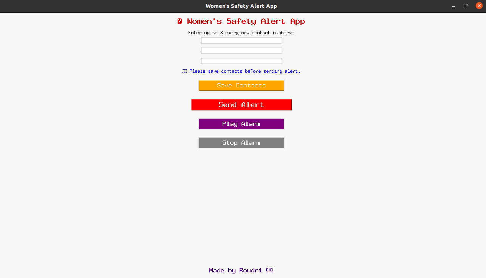
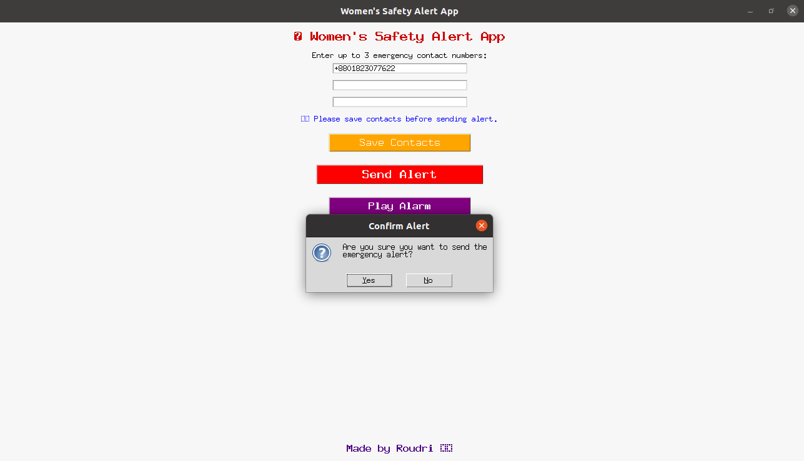
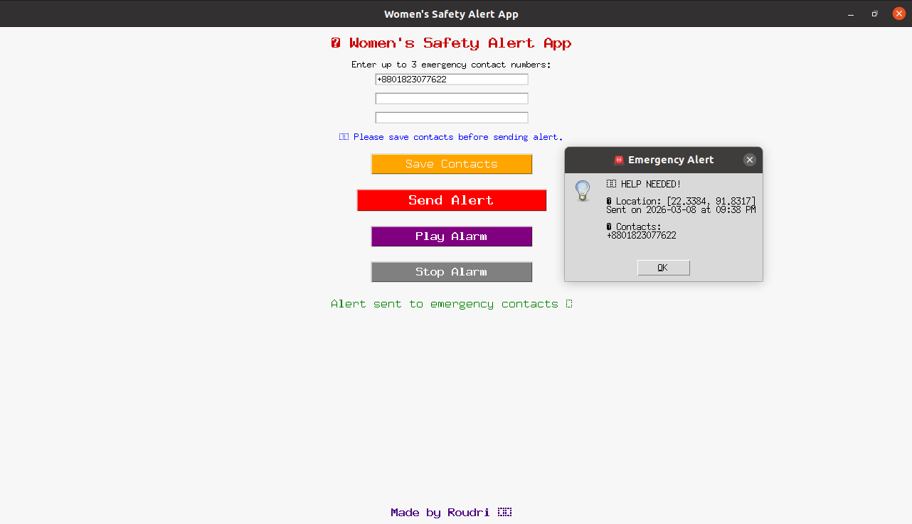

# 🚨 Women’s Safety Alert App
A Python-based desktop emergency alert application built using Tkinter.
 This project demonstrates GUI development, event-driven programming, and safety-focused software design.


## 📸 Application Preview

### Main Interface


### Alert Confirmation


### Alert Sent



## 📌 Project Overview
- The Women’s Safety Alert App allows users to:

- Save emergency contact numbers

- Send an emergency alert with approximate location

- Play a loud alarm sound to attract nearby attention

- Confirm alert action before sending

- Store contacts locally using file handling


## 🛠 Technologies Used

- Python 3

- Tkinter (GUI)

- Geocoder (IP-based location detection)

- Pygame (Alarm sound system)

- Threading (Non-blocking alarm playback)

- File handling (contacts.txt storage)


## ✨ Key Features

Structured contact saving system

Alert confirmation dialog before sending


 Displays:

- Current timestamp

- Approximate IP-based location

- Saved emergency contacts

- Alarm system with Play and Stop controls

- Input validation to prevent empty submissions

- Clean and organized user interface


## ▶️ How to Run the Project

- Install Python 3

- Install required libraries:

- pip install geocoder pygame
Ensure alarm.mp3 is in the same directory

- Run:

python main.py


## 🎯 Purpose of the Project

I developed this Women’s Safety Alert App to practice building a functional desktop application using Python and Tkinter while focusing on a socially meaningful problem.

Growing up in an environment where personal safety, especially for women—is an important concern, I have always been interested in how technology can contribute to safer communities. This project allowed me to explore how simple software tools can help raise awareness and provide quick emergency assistance features such as location sharing, alarms, and emergency contact alerts.

Through this project, I aimed to strengthen my skills in:

- GUI development using Tkinter

- Event-driven programming

- File handling and data persistence

- Integrating external Python libraries

- Designing simple safety-focused applications

This project reflects both my technical growth and my interest in building practical safety-oriented solutions.


## 🔮 Future Improvements

- SMS-based real-time alert integration

- GPS-based precise location tracking

- Cloud-based contact storage

- Mobile application version

  

 ## 📂 Project Structure

```
womens-safety-alert-app
│
├── main.py               # Main application code
├── contacts.txt          # Stored emergency contacts
├── alarm.mp3             # Alarm sound file
├── README.md             # Project documentation
│
└── images
    ├── 01_main_interface.png
    ├── 02_confirmation_dialog.png
    └── 03_alert_sent.png
``` 


## Author
Roudri Das  
Aspiring Computer Science Student


